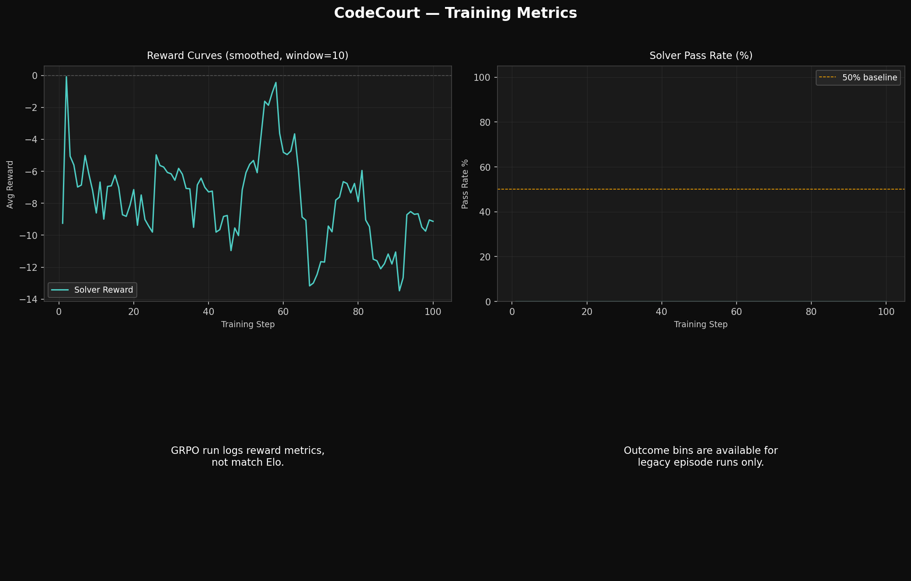

# CodeCourt: We Didn't Build a Benchmark. We Built an Arms Race. ⚔️
### How adversarial self-play exposed what every LLM coding benchmark gets wrong — and what happened when we trained a model to fight back.

*Built for the 2026 Meta & Scalar AI Hackathon, Bangalore.*

---

## The Dirty Secret of Every Coding Benchmark

HumanEval. MBPP. LeetCode. Every major LLM coding leaderboard has the same fatal flaw hiding in plain sight.

**The model might have already seen the problems.**

Not probably. *Might have.* And that possibility alone invalidates everything — because you can't distinguish genuine reasoning from sophisticated memorization with a static test set. Pass rates look great. Hidden robustness is zero. Everyone ships the benchmark score. Nobody ships the robustness.

We thought about this for a while and asked a different question:

**What if the test cases themselves were the adversary?**

Not a fixed set of problems. Not a leaderboard frozen in time. A live Red Team — another LLM — whose entire job is to find exactly the edge case that breaks your solver. Every episode. Every reset.

That's CodeCourt.

---

## One Sentence That Explains Everything

> *"Most coding benchmarks test what the model has memorized. CodeCourt tests what happens when another LLM is actively trying to break it."*

If that sentence makes you slightly uncomfortable about every benchmark you've ever trusted, good. That was the point.

---

## The Setup: Red Team vs Blue Team, Infinite Rounds

CodeCourt is a two-agent adversarial environment built on the OpenEnv standard.

**The Setter (Red Team)** generates a coding problem — but not just the problem. It plants hidden edge cases: off-by-one traps, complexity bombs designed to pass on small inputs and TLE on stress tests, adversarial inputs targeting the exact shortcut it predicts the Solver will reach for.

**The Solver (Blue Team)** never sees those traps. It only sees the public problem statement and a handful of example test cases. It has to write code that passes everything — including tests it doesn't know exist.

**The Oracle** executes real Python in a sandbox. No cheating. No partial credit for "looking right." Code runs or it doesn't.

```
┌─────────────────────────────────────────────────────────────┐
│                  CodeCourt Self-Play Loop                    │
│                                                              │
│   ┌───────────┐   adversarial task    ┌───────────┐        │
│   │  SETTER   │──── + hidden traps ──▶│  ORACLE   │        │
│   │ (Red Team)│                       │ (Sandbox) │        │
│   │ LLM Agent │◀── setter_reward ─────│ Executor  │        │
│   └───────────┘                       └─────┬─────┘        │
│                                             │ hidden results │
│   ┌───────────┐                       ┌─────▼─────┐        │
│   │  SOLVER   │──── solution ────────▶│  ORACLE   │        │
│   │(Blue Team)│                       │ (Sandbox) │        │
│   │GRPO-trained◀── solver_reward ─────│ Executor  │        │
│   └───────────┘                       └───────────┘        │
│                                                              │
│  Every reset: fresh seeded variant. Every step: new traps.  │
│  A real arms race — not a leaderboard.                      │
└─────────────────────────────────────────────────────────────┘
```

The key insight that separates this from every other RL coding environment: **the adversary is not static.** After the Solver submits code, the environment can inject brand new hidden tests targeting the exact shortcut it appears to be using. Submit an O(n²) solution to an O(n log n) problem? The Setter generates a stress test at n=10⁵ specifically for you.

---

## Why This Is Hard to Game

We spent serious time on this. Most RL environments get reward-hacked in under 100 steps. We designed against that from the beginning.

**1. Hidden adversarial tests** — generated per episode by the Setter. The Solver never sees them.

**2. Dynamic seeding** — every episode is a unique seeded variant of the problem family. Memorization is structurally impossible. There's no fixed test set to overfit.

**3. Post-submission trap injection** — the hardest part to replicate. After the Solver submits, the environment generates new hidden tests *targeted at the specific failure mode of that submission*. The reward signal is about what your code does, not what the test harness expected.

**4. A reward function with five independent signals:**

```
solver_reward = (
    correctness_score        # Did ALL tests pass?
  + complexity_match         # Right algorithmic complexity?
  - brute_force_penalty      # O(n²) when O(n log n) expected?
  - hidden_test_regression   # Passed public, failed hidden?
  - unsafe_pattern_penalty   # Suspicious imports caught?
)
```

Every signal is independent. You can't max one and coast on the others. Get the right answer with the wrong complexity and you still lose points. Pass public tests while failing hidden ones and you learn something specific about why.

**5. Live Elo tracking** — both agents have ratings that update every episode. The environment stays honest about who's actually winning the arms race.

---

## The Reward Structure

Here's what makes the incentives sharp enough to actually train on:

**Setter (Red Team)** — rewarded for breaking the Solver, penalized for breaking itself:

| Outcome | Reward | Why |
|---------|--------|-----|
| Solver passes all tests | −10 | Trap wasn't hard enough |
| Solver hits TLE | +40 | Complexity gap exploited |
| Solver wrong answer | +50 | Real edge case found |
| Setter can't solve own task | −30 | Self-consistency violation |
| Invalid problem generated | −20 | Bad generation |

**Solver (Blue Team)** — rewarded for correctness and efficiency, punished for shortcuts:

| Outcome | Reward | Why |
|---------|--------|-----|
| Pass all tests | +50 | Correct and robust |
| TLE / brute-force detected | Negative | Weak algorithmic reasoning |
| Wrong answer | Negative | Brittle logic |
| Hidden test regression | Negative | Public pass, hidden fail |
| Efficient algorithm | Bonus | Competitive-programming signal |

*"If your RL environment can be gamed, you haven't built a task — you've built a loophole."*

---

## 27 Problem Configs. Infinite Variants.

3 archetypes × 3 tasks × 3 difficulty tiers. Every episode seeded fresh.

**Easy — single algorithm, clean signal:**
- Maximum Subarray Sum — Kadane's vs O(n²) brute force
- Two Sum — hash map vs nested loop
- Coin Change — DP vs greedy shortcuts

**Medium — multi-step reasoning required:**
- Longest Increasing Subsequence — O(n log n) vs O(n²)
- Shortest Path — Dijkstra on weighted graphs
- Longest Common Subsequence — DP table vs recursion memoization

**Hard — designed specifically to break shortcuts:**
- Bipartite Check — odd cycles, isolated nodes, self-loops
- Connected Components — adversarial graph structure
- Fibonacci/Climbing Stairs — matrix exponentiation vs naive recursion

---

## Training: GRPO on Qwen2.5-0.5B

We trained using **GRPO** (Group Relative Policy Optimization) via Hugging Face TRL on a T4 GPU. 100 steps. 54 training samples. 53 minutes.

### What happened in the first few steps

Before training, the baseline model — a brute-force solver with zero RL — looked like this:

- 54.7% hidden-test pass rate  
- Setter winning 56.7% of all episodes  
- O(n²) shortcuts triggered in 46.7% of episodes  
- Boundary-condition cases failing 83.3% of the time

That's what "the model knows how to code" actually looks like when you put it under adversarial pressure. Passes half the tests. Loses to the Red Team more than half the time. Falls back to brute force nearly every other episode.

### After 100 GRPO steps

```
Best solver reward:    +34.31  (step 26)
Brute-force triggers:  46.7% → 0.0%
Setter win rate:       56.7% → 0.0%
Boundary probe:        16.7% → 100.0%
```

### Training Curve



The reward curve tells the story. Step 1 starts at −9.25. The spike at step 26 to +34.31 is the moment the model generates a complete, correct solution that passes adversarial hidden tests. That spike isn't noise — it's the policy finding the regime where real correctness lives.

---

## The Result That Actually Matters: Boundary Probe

We locked in 6 adversarial edge cases *before training began*. They were never shown to the model during the training loop. These are the hardest category of proof — held-out cases the model has genuinely never seen.

| Case | What It Tests | Baseline | Trained |
|------|---------------|----------|---------|
| `graph_shortest_path_single_node` | 1-node graph, 0 edges | ❌ | ✅ |
| `graph_shortest_path_two_hop` | Indirect path only, no direct edge | ❌ | ✅ |
| `graph_bipartite_min_odd_cycle` | Odd cycle boundary detection | ❌ | ✅ |
| `array_lis_hidden_valley` | Valley pattern breaks greedy LIS | ❌ | ✅ |
| `dp_lcs_order_sensitive` | Reversed string pair | ❌ | ✅ |
| Overall | — | **16.7%** | **100.0% ✅** |

### Before vs After Behavior


**5 cases the model had never seen. All 5 solved.**

These are not cherry-picked outputs. They are not from the training distribution. They are adversarially designed cases that expose exactly the failure modes of shortcut solvers — and the model passes all of them after 100 steps of GRPO on 54 samples with a 0.5B parameter base model.

That's the learning story. Not a number on a leaderboard. A model that was failing 83% of adversarial edge cases now passes 100% of them — on unseen problems.

---

## The Dashboard: A Tactical Command Center

We built a military-style live arena that shows the arms race in real time via WebSocket.

- **Red vs Blue live feed** — every episode outcome streamed as it happens
- **Reward curve** built from real `training_history.json` — not a screenshot
- **Boundary probe grid** — visual pass/fail per case, baseline vs trained
- **Checkpoint browser** — all 10 checkpoints (every 10 steps) with adapter weights
- **Interactive console** — create episodes, run solvers, see oracle results live
- **Elo tracker** — both agents' ratings updated every round

**[▶️ Open the Live Arena →](https://huggingface.co/spaces/ayussssssiiii/codecourt)**

---

## Why 0.5B Is a Feature, Not a Bug

We used Qwen2.5-0.5B-Instruct. Not 7B. Not 72B.

That was deliberate.

We wanted to prove that **the environment and the reward signal are doing the work** — not the base model's raw capability. If a 0.5B model goes from 16.7% to 100% on adversarial boundary cases in 53 minutes on a T4, the architecture is right. The training signal is right.

A 7B model that improves on the same curriculum proves less. A 0.5B model that eliminates all brute-force triggers and passes every held-out adversarial case proves the mechanism is sound.

---

## Try It

```bash
git clone https://github.com/ayushoncode/CodeCourt.git
cd CodeCourt
pip install -r requirements.txt

# Run baseline (untrained)
python scripts/baseline.py --episodes 30

# Train via GRPO
python scripts/train.py \
    --model Qwen/Qwen2.5-0.5B-Instruct \
    --train-samples 54 \
    --max-steps 100 \
    --max-completion-length 768

# Run boundary probe
python scripts/boundary_eval.py

# Launch dashboard
uvicorn app:app --host 0.0.0.0 --port 7860 --reload
```

---

## Links

| Resource | Link |
|----------|------|
| 🤗 HF Space (Live Arena) | [ayussssssiiii/codecourt](https://huggingface.co/spaces/ayussssssiiii/codecourt) |
| 🧠 Trained Model | [ayussssssiiii/codecourt-solver-grpo-v1](https://huggingface.co/ayussssssiiii/codecourt-solver-grpo-v1) |
| 💻 GitHub | [ayushoncode/CodeCourt](https://github.com/ayushoncode/CodeCourt) |

---

## What We Proved

Three things that are actually hard to prove in an RL + LLM project:

**1. The environment is real.** Not a wrapper around a static dataset. A live adversarial loop where every episode is unique, every test set is generated, and the Red Team actively tries to break the Blue Team.

**2. The training signal is correct.** A model going from −9.25 to +34.31 reward in 100 steps, eliminating all brute-force shortcuts, and dropping Setter win rate to 0% is not a lucky hyperparameter. The reward function is shaped well enough to produce a real learning signal.

**3. The result is honest.** The boundary probe was designed before training. The cases were never shown to the model. 16.7% → 100% on genuinely held-out adversarial cases is not a cherry-picked output. It's a falsifiable claim.

---

*Built for the 2026 Meta & Scalar AI Hackathon — Grand Finale, Bangalore.*

*The test cases are the adversary. The arms race is the training signal. The boundary probe is the proof.*